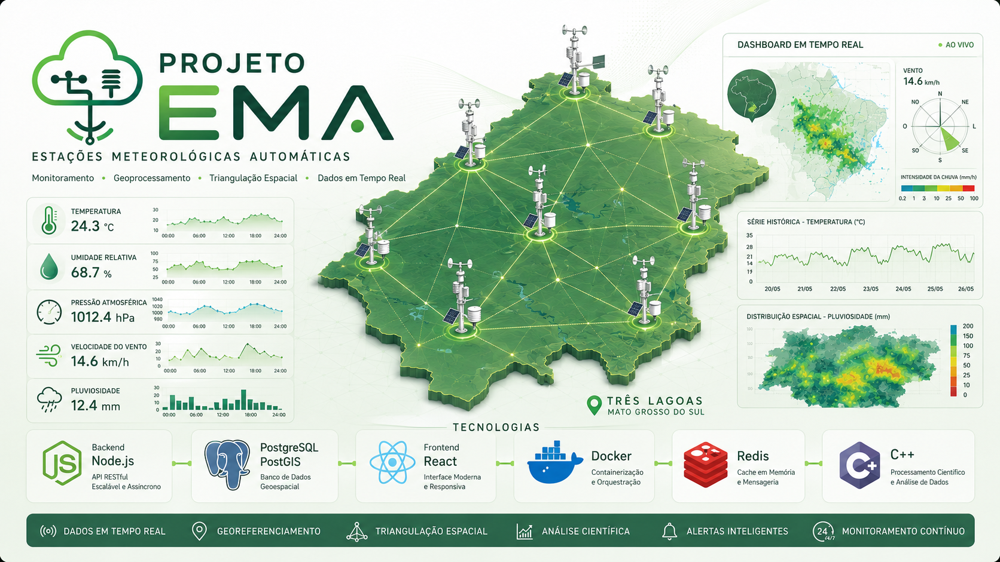
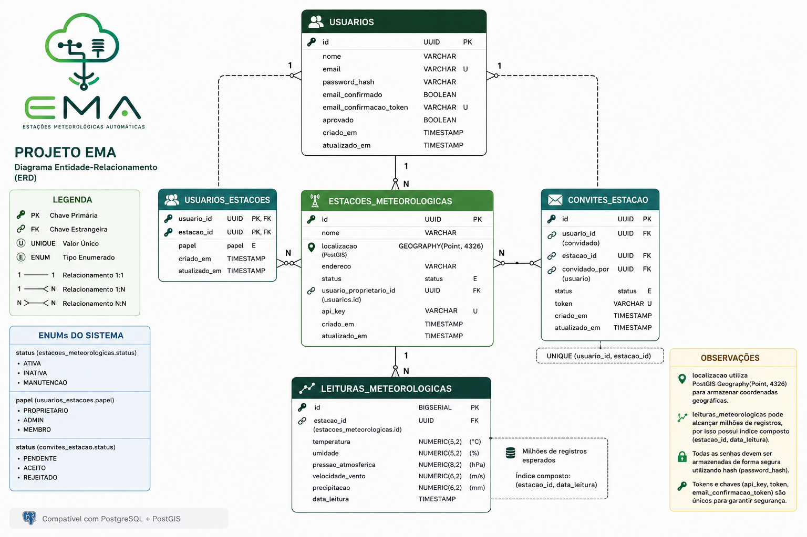

Projeto EMA — Estações Meteorológicas Automáticas

  

  <strong>Sistema completo para coleta, armazenamento, processamento e visualização de dados meteorológicos em tempo real.</strong>

  

---

Sobre o Projeto

O Projeto EMA (Estações Meteorológicas Automáticas) é uma iniciativa acadêmica desenvolvida no Instituto Federal de Mato Grosso do Sul (IFMS) com o objetivo de construir uma plataforma integrada para monitoramento meteorológico.

A solução permite coletar dados ambientais em tempo real, armazená-los de forma estruturada, disponibilizá-los através de APIs e gerar análises estatísticas e espaciais a partir de múltiplas estações meteorológicas.

---

Objetivos

- Coletar dados meteorológicos em tempo real
- Armazenar informações de forma estruturada
- Disponibilizar dados através de APIs REST
- Permitir visualização e análise dos dados
- Realizar processamento estatístico
- Aplicar técnicas de triangulação e interpolação espacial
- Servir como plataforma de pesquisa, ensino e extensão

---

Arquitetura do Sistema

O sistema é dividido em três grandes camadas:

Estações Meteorológicas

Responsáveis pela aquisição dos dados ambientais.

Sensores utilizados

- Temperatura
- Umidade relativa do ar
- Pressão atmosférica
- Luminosidade
- Velocidade do vento
- Pluviosidade

---

Backend

Responsável por:

- Receber dados das estações
- Validar informações recebidas
- Armazenar dados históricos
- Disponibilizar API REST
- Gerenciar autenticação e autorização
- Integrar os serviços de processamento

Tecnologias

- Node.js
- Express
- Sequelize
- PostgreSQL
- PostGIS
- Redis
- Docker

---

Processamento Científico

Responsável por:

- Tratamento de dados meteorológicos
- Cálculos estatísticos
- Triangulação espacial entre estações
- Interpolação geográfica
- Geração de informações derivadas

Tecnologias

- C++
- Algoritmos Numéricos
- Geometria Computacional
- Processamento Científico

---

Frontend

Responsável por:

- Visualização dos dados em tempo real
- Dashboards meteorológicos
- Exibição de históricos
- Consumo da API
- Visualização geográfica das estações
- Consulta de métricas ambientais

Tecnologias

- React
- TypeScript
- Vite
- Tailwind CSS

---

Diagrama do Banco de Dados

  

---

Estrutura do Projeto

projeto-ema/
│
├── apps/
│   ├── api/
│   │   ├── src/
│   │   └── docker/
│   │
│   └── web/
│       ├── src/
│       └── public/
│
├── infra/
│   ├── docker/
│   └── nginx/
│
├── images/
│   ├── logo.png
│   ├── cover.png
│   └── diagrama_der.png
│
├── Dockerfile.api
├── package.json
└── README.md

---

Funcionalidades

Implementadas

- Cadastro e autenticação de usuários
- Recebimento de dados meteorológicos
- API REST
- Banco de dados PostgreSQL
- Interface web para visualização
- Gerenciamento de estações
- Histórico de medições

Em Desenvolvimento

- Triangulação automática entre estações
- Interpolação espacial de dados
- Dashboards avançados
- Sistema de alertas meteorológicos
- Suporte a múltiplas estações simultâneas
- Mapas meteorológicos

---

Fluxo de Dados

Estações Meteorológicas
           │
           ▼
        Backend
           │
           ▼
 PostgreSQL/PostGIS
           │
    ┌──────┴──────┐
    ▼             ▼
Processamento     API
   em C++
    │
    ▼
 Frontend

---

Tecnologias Utilizadas

Categoria| Tecnologias
Backend| Node.js, Express, Sequelize
Frontend| React, TypeScript, Vite
Banco de Dados| PostgreSQL, PostGIS
Infraestrutura| Docker, Nginx
Cache| Redis
Processamento| C++
Controle de Versão| Git
Sistema Operacional| Linux

---

Instalação

Clonar o projeto

git clone https://github.com/henryifms/projeto-ema.git
cd projeto-ema

Instalar dependências

yarn install

Executar o Frontend

yarn web

Executar a API

yarn api

Executar com Docker

cd infra/docker
docker compose up --build

---

Aplicações Acadêmicas

O Projeto EMA pode ser utilizado em pesquisas e estudos relacionados a:

- Meteorologia
- Estatística
- Geoprocessamento
- Sistemas Distribuídos
- Banco de Dados Geográficos
- Programação Científica
- Internet das Coisas (IoT)

---

Contribuição

Contribuições são bem-vindas.

Para colaborar:

1. Faça um Fork do projeto
2. Crie uma Branch para sua feature
3. Faça Commit das alterações
4. Abra um Pull Request

---

Autor

Henry Thomaz

Instituto Federal de Mato Grosso do Sul (IFMS)

---

Licença

Este projeto é livre para uso, estudo, modificação e distribuição para fins acadêmicos, educacionais, comerciais ou pessoais.
